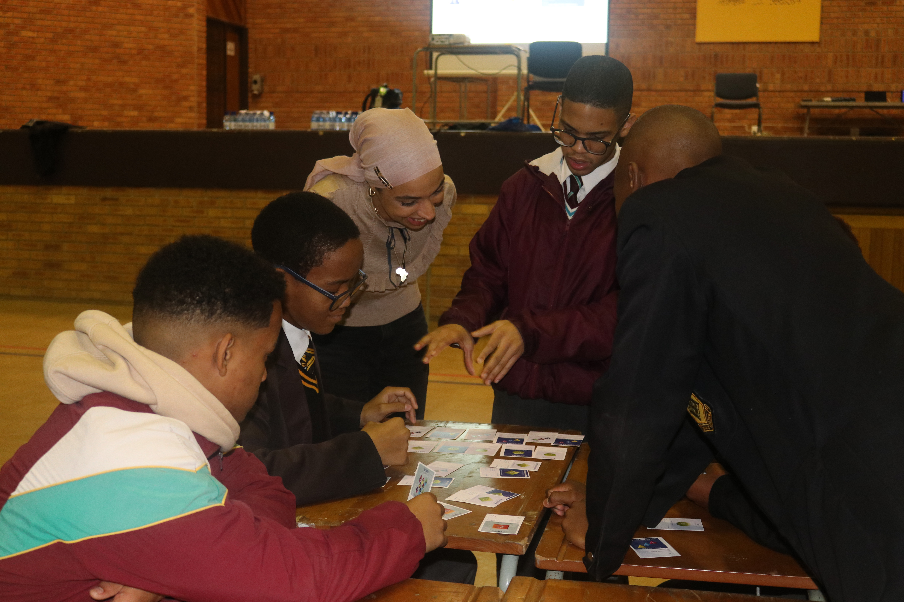

# Outreach
Research indicates that girls in Africa tend to lose interest in physics around the age of 12. **Mounia wants to change this**. After attending the
[African School of Physics](https://africanschoolofphysics.org) (ASP2016) in Kigali, Rwanda in 2016, Mounia found this journey with ASP beneficial for both herself 
and the advancement of the ASP’s mission. She attended ASP in 2016 as a student and returned in 2022 as a lecturer. 
Mounia was appointed to the ASP IOC with immediate impact, where she led the organization of the third African Conference on Fundamental and Applied Physics (ACP2023)
and the eighth African School of Physics (ASP2024).

One of the programs of ASP is an outreach event organized for high school learners over a period of one week. 
The objective is to motivate learners to develop and maintain interest in physics and its applications. 
Upwards of 200 learners per day from the host country can participate in this program, and the participating 
learners are identified by the local organizing committee (LOC) in consultation with the Regional Educational Authorities around the venue.

Here is a list of the ASP learner programs I have participated in:
- **[ASP2024 High School](https://indico.cern.ch/event/1393743/)**  
- 

* Dr. Mounia Laassiri, discussing the mathematical formalism of the concept of center-of-mass and the condition of stability of the 15-block Jenga cantilever that the learners succeeded in building.* 

- **[ASP2024 High School]([https://indico.cern.ch/event/1393743/](https://africanschoolofphysics.org/asp2022/))**   

* Dr Mounia Laassiri had fun with learners playing particle cards at the Nelson Mandela Bay Science and Technology Centre.* 
