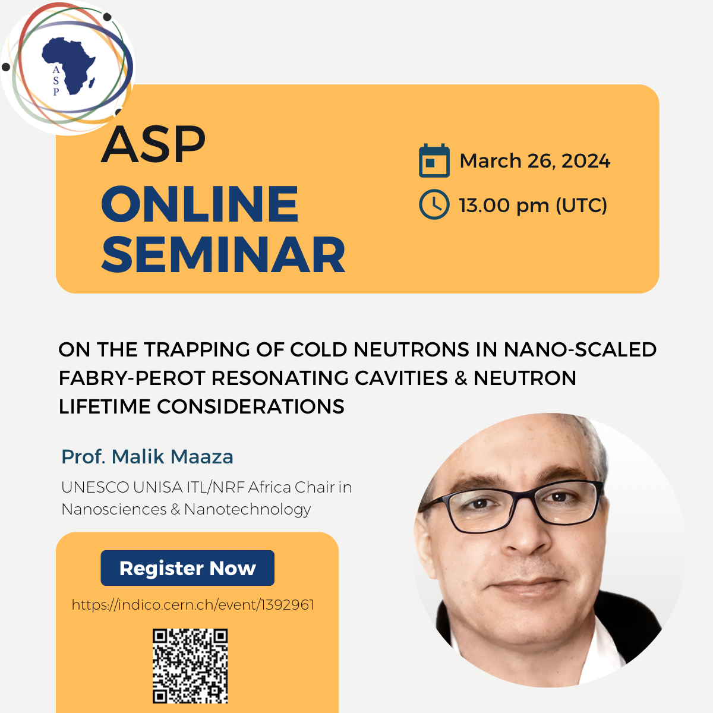
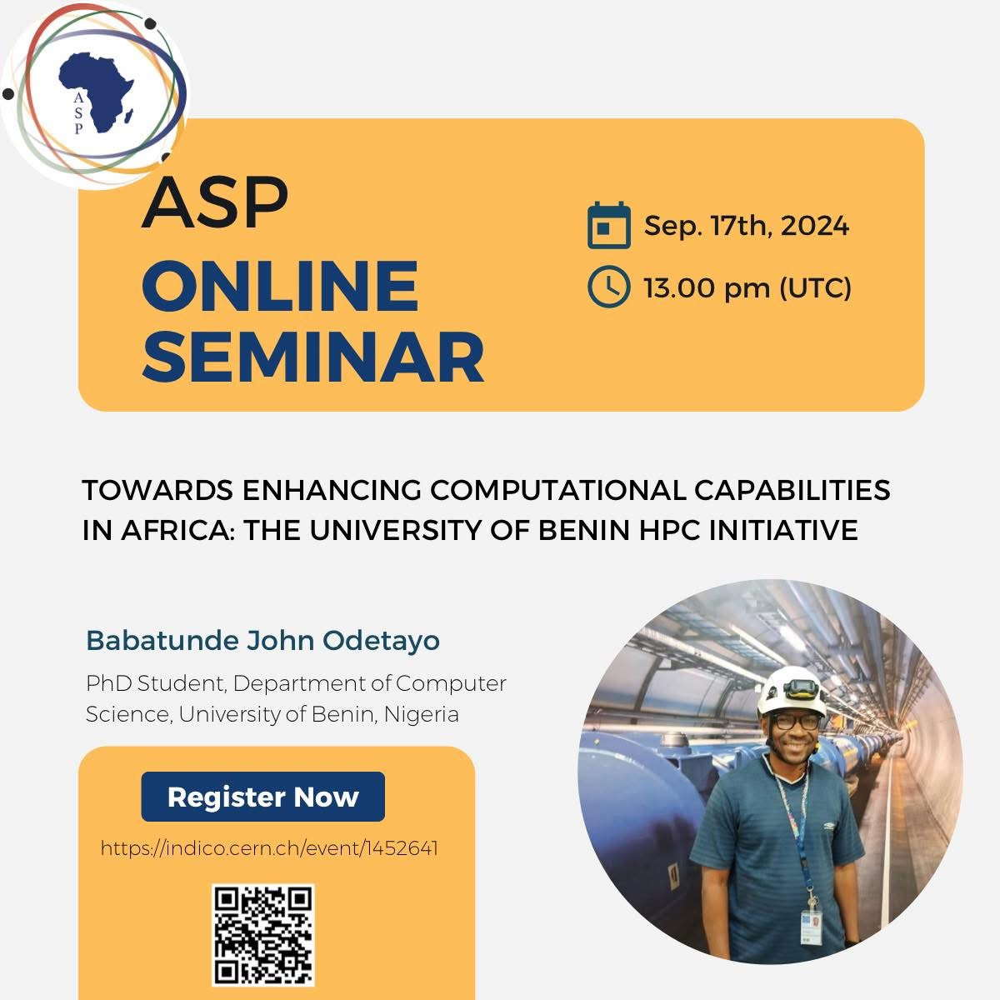
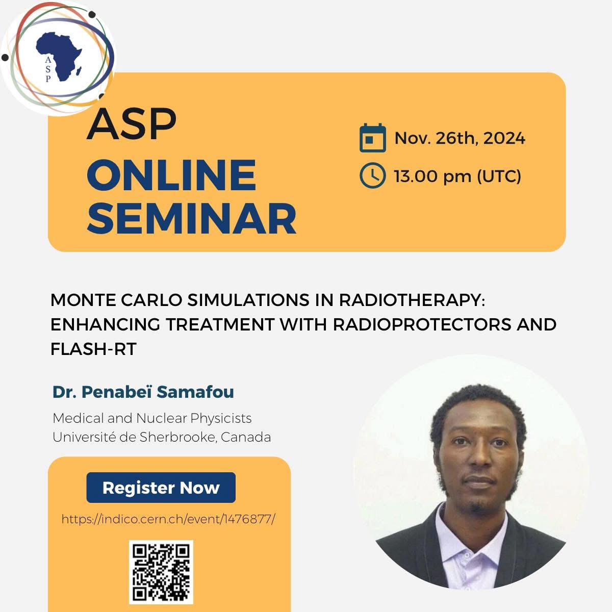

# Outreach
Research indicates that girls in Africa tend to lose interest in physics around the age of 12. **Mounia wants to change this**. After attending the
[African School of Physics](https://africanschoolofphysics.org) (ASP2016) in Kigali, Rwanda in 2016, Mounia found this journey with ASP beneficial for both herself 
and the advancement of the ASP’s mission. She attended ASP in 2016 as a student and returned in 2022 as a lecturer. 
Mounia was appointed to the ASP IOC with immediate impact, where she led the organization of the third African Conference on Fundamental and Applied Physics (ACP2023)
and the eighth African School on Fundamental and Applied Physics (ASP2024).

## ASP learner program
One of the programs of ASP is an outreach event organized for high school learners over a period of one week. 
The objective is to motivate learners to develop and maintain interest in physics and its applications. 
Upwards of 200 learners per day from the host country can participate in this program, and the participating 
learners are identified by the local organizing committee (LOC) in consultation with the Regional Educational Authorities around the venue.

  
  

 

## ASP Online Seminars
While joining the ASP-IOCs, I began managing the ASP Online Seminars—a monthly seminar or colloquium designed to supplement the ASP term schools.

  
  
  

[Learn more about ASP Online Lecture Series](https://indico.cern.ch/category/12710/) 

## Refereed Publications
1. B. Mulilo et al. [*Young Physicists Forum and the Importance for Education and Capacity Development for Africa*](https://arxiv.org/abs/2206.15171). *arxiv, physics.soc-ph, 2022*.
2. M. Laassiri et al. [*ASFAP Working Group Summary of Societal Engagements*](https://arxiv.org/abs/2205.11362)). *arxiv, physics.soc-ph, 2022*.

