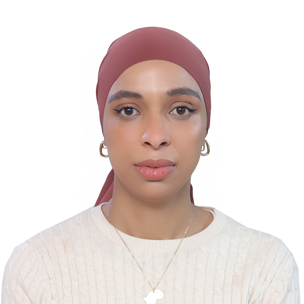

# Mounia Laassiri, PhD

My name is Mounia Laassiri, and I'm a curious and keen physicist currently working as a postdoctoral researcher at Brookhaven National Laboratory (BNL) [ref.](https://www.bnl.gov/staff/mlaassiri), as part of the ATLAS collaboration on the testing of the ATLAS strip tracker upgrade (ITk) and the African School of Physics (ASP) [ref.](http://africanschoolofphysics.org). I hold a Ph.D. in physics and nuclear instrumentation from Mohammed V University in Morocco, where I also earned a B.Sc. in fundamental studies and an M.Sc. in the security of computer networks and embedded systems.

I serve as a co-convener of the African Young Physicists Forum (YPF) within the African Strategy for Fundamental and Applied Physics (ASFAP) [ref.](https://africanphysicsstrategy.org). In this role, I organize early-career African physicists to address issues related to their career growth and development, supporting the mission of the African Physical Society. YPF activities include panel discussions, workshops, invited talks, and contributions to the ASFAP report.

I'm also an editor of the African Physics Newsletter (APN) [ref.](https://www.aps.org/publications/african-physics-newsletter), published quarterly by the American Physical Society (APS). Additionally, I have been appointed as a Trustee on the Board of Trustees of ASP and to the ASP International Organizing Committee (IOC). Recently, I was appointed to the Governing Council (GC) of the Arab Physical Society (ArPS) [ref.](http://www.arabphysicalsociety.org) and most recently, she was appointed as a Member-at-Large of the APS Forum on International Physics (FIP), with her term commencing on January 1st, 2025 [ref.]([http://www.arabphysicalsociety.org](https://engage.aps.org/fip/governance/executive-committee/committee-members?Execute=1)).

Through my involvement in initiatives like the ASP, ASFAP, APN, ArPS and FIP, I hope to continue mentoring the next generation of African and Arab physicists.

# In more detail:
* [Academic CV](CV/Academic_CV.pdf)
* <a href="../Outreach/Description.html" target="_blank">Outreach</a>  
* [Linkedin](https://fi.linkedin.com/in/mounia-laassiri-85390185)
* [ORCiD](https://orcid.org/0000-0001-7146-4468)
